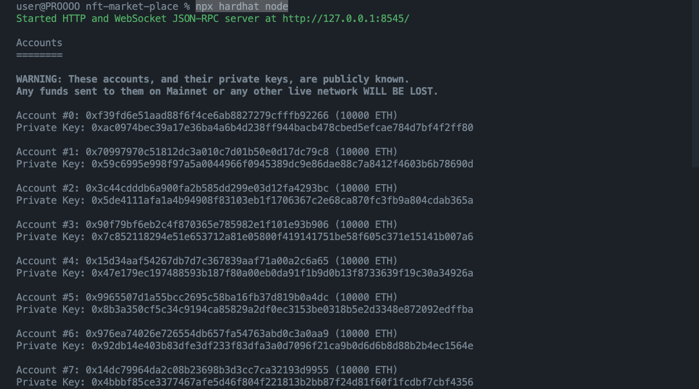
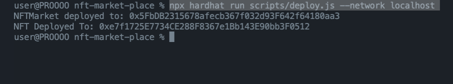
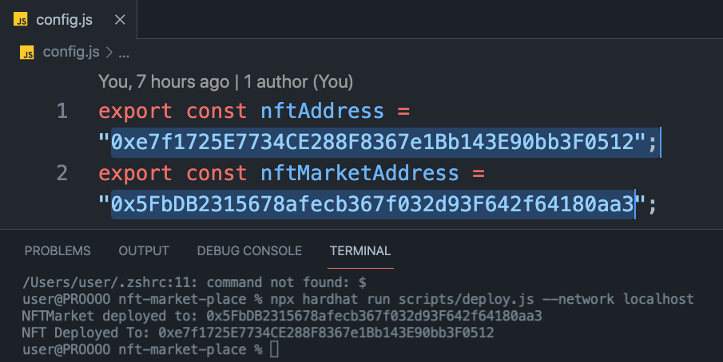
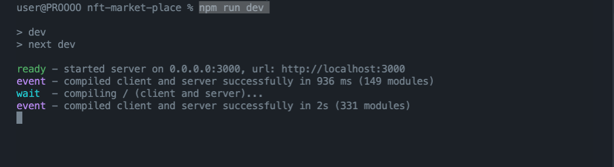

# NFT MARKETPLACE on POLYGON BLOCKCHAIN 

## To Run the Project 

Open 3 Terminals at the Folder

### First Terminal 
`npx hardhat node`

 

### Second Terminal 
`npx hardhat run scripts/deploy.js --network localhost`

From here copy the NFT address and NFTMarket Address and paste it into the **config.js**.

 

### Third Terminal 
`npm run dev` 

 

Then Open Your **Localhost** in the Browser
